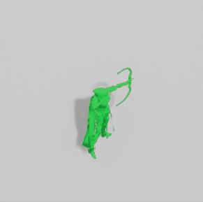
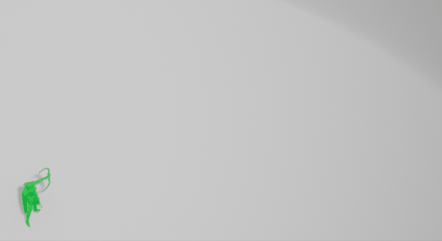
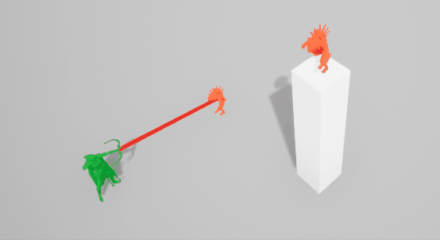

# Archer game with event-driven state machines

This is the current state of a WIP side-project I've been making. As the title says, it features an event-driven state-machine system I find very easy to work with, respecting the SOLID principles.

<p align="center"></p>

## Project

If you clone the project you'll notice there are no 3D assets, and the characters are just cubes. You may download your own, with their animations, and replace them.
For my prototype I'm using [Paragon Sparrow](https://www.unrealengine.com/marketplace/en-US/product/paragon-sparrow) as the character, and the enemies are from [Infinity Blade's Aversaries](https://www.unrealengine.com/marketplace/en-US/product/infinity-blade-enemies)

A part from the character animations assets, you'll need to create your own Blueprint Animation Instance, as in `UCharacterAnimInstance`


## Features

* `ArcherPlayerController` Handling the game states, and the camera inputs.
* `ArcherPlayerCameraManager` Camera rotations and current view.
* `ArcherCharacter`Contains the movement, mechanics and state-machines for the character.
* `SlowTimeManager`Slows global time, with exceptions.
* `Enemy`Handled via a basic AI, these will just find and go to the player location, and die when hit with a projectile.
* `InteractiveElement`A very simple "puzzle" system, used in the Demo level.
* [StateMachineBase](Docs/StateMachine.md) The most interesting element in my opinion. Handling the different character states.


## Mechanics
*Look for all actual inputs inside `Edit -> Project Settings -> Input`*

The player is able to:
* Walk/Sprint/Jump
* AutoAim/FreeAim + Shoot
* Set "OrbitMode" and Rotate Camera

When free-aiming, the character follows the player's pointer (mouse/gamepad). Otherwise, on auto-aim, `ArchTrace` will try to find the smallest angle (enemy - character - pointer) on screen location.
<p align="center"></p>

The enemies approaching the player and getting killed via free-aim and auto-aim.
<p align="center"></p>

Of course, with the same angle-aim, it also computes the closest position to either the mouse, or relative joystick value with each enemy distance.
<p align="center"></p>

And this can also be applied with aligned enemies:
<p align="center"></p>

Finally, interacting with the level elements and rotating the camera (gameplay with gamepad)
<p align="center"></p>


### StateMachine

I've programmed two state machines: `LocomotionStateMachine` and `MechanicsStateMachine`, they both derive from  `StateMachineBase`.
With two separated state machines, we can easily allow the character to perform different mechanics with different locomotions, and viceversa.

All states derive from `StateBase` (that class could be an interface). As you'll see, there are many that are just not implemented.
These states just need to override Begin() and End() methods.

`StateMachineBase.h`will set the state as follows:
```cpp
template <class T>
void SetState()
{
	State->End();
	delete State;
	State = new T(this);
	State->Begin();
	SetSpecificState();
}
```
It End()s and deletes the last state, and creates and Begin()s the new one. In case each state machine needs its specific state reference, it also calls the virtual method for it.

All movements and actions are called via these two delegates, declared in `StateMachineBase.h`
```cpp
DECLARE_MULTICAST_DELEGATE_OneParam(MovementSignature, float);
DECLARE_MULTICAST_DELEGATE(ActionSignature);ate();
```

That way, we loose coupling between classes and separate business logic with calling; the specific code is atomized in other classes so that the state itself just binds the appropriate logic to different delegates.
Let's look at a specific example: `WalkState.cpp`
```cpp
void FWalkState::Begin()
{
	StateMachine->GetCharacterAnimations()->SetLocomotionState(ECharacterLocomotionState::Normal);
	StateMachine->GetCharacterMovement()->SetWalkSpeed();
	StateMachine->GetMechanicsStateMachine()->SetAimReadyState();//sets a mechanic state, allowing to aim

  //binding Raw delegates to Movement
	StateMachine->MoveForwardDelegate.AddRaw(StateMachine->GetCharacterMovement(), &FCharacterMovement::MoveForward);
	StateMachine->MoveRightDelegate.AddRaw(StateMachine->GetCharacterMovement(), &FCharacterMovement::MoveRight);
  
  //for StartRunDelegate, it binds the SetRunState() method declared in the StateMachine itself
	StateMachine->StartRunDelegate.AddRaw(StateMachine, &FLocomotionStateMachine::SetRunState);

  //when it stops aiming, it allows to aim again
	StateMachine->GetMechanicsStateMachine()->StopAimingDelegate.AddRaw(StateMachine->GetMechanicsStateMachine(),
	                                                                    &FMechanicsStateMachine::SetAimReadyState);
}

//on End, just clear your delegates
void FWalkState::End()
{
	StateMachine->MoveForwardDelegate.Clear();
	StateMachine->MoveRightDelegate.Clear();
	StateMachine->StartRunDelegate.Clear();

	StateMachine->GetMechanicsStateMachine()->StopAimingDelegate.Clear();
}
```
